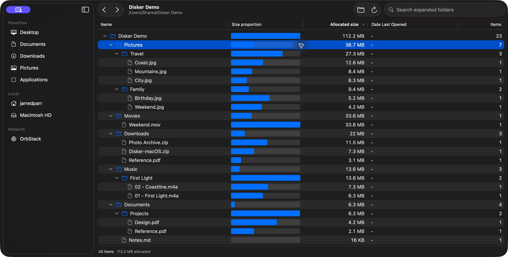

<p align="center">
  
</p>

<h1 align="center">Disker</h1>

<p align="center">Native SwiftUI disk usage app for macOS 26 and later, using Swift 6.2.</p>



## Download

Download the universal macOS app from [GitHub Releases](https://github.com/sythelabs/disker/releases/latest). Builds support Apple Silicon and Intel Macs running macOS 26 or later. The app is ad-hoc signed and is not notarized.

Open the DMG and drag Disker into the Applications folder shown in the installer window. Eject the installer, then open Disker from Applications.

Install version 0.1.4 or later once in a writable location, such as `/Applications`. Disker then checks for updates daily, downloads them automatically, and installs them when you quit. Use **Disker > Check for Updates** to install the latest release immediately. Updates and the update feed are authenticated with Ed25519 signatures. [Update publishing and signing](docs/self-updates.md).

## Contributing and releases

Changes to `main` require a pull request with passing `Version increase` and `Build and test` checks. Every PR must increase both `CFBundleShortVersionString` (stable `major.minor.patch`) and `CFBundleVersion` (positive integer) in `Info.plist` relative to the latest target branch. Update stale PRs after another version merges.

Every push to `main` runs the Swift tests, builds and verifies a universal release app, signs the ZIP and update feed, and publishes a `v<version>` GitHub Release containing the drag-to-install DMG, app ZIP, `appcast.xml`, and SHA-256 checksums. PR builds are available as workflow artifacts. `just release` builds the same app locally at `.build/Disker.app`. `just dmg` builds and verifies the installer in `dist/`; it requires `uv` for the pinned dmgbuild tool. `just package-dmg <app-bundle>` packages an existing universal app. The DMG is created after feed generation so Sparkle continues to use the ZIP update.

## Run

```sh
just run
```

Requires `just` and full Xcode 26 or later, including Swift Testing. The standalone Command Line Tools on this host do not include the `Testing` module. Recipes select `/Applications/Xcode.app/Contents/Developer`; set `DEVELOPER_DIR` to use another installation.

Build the local, ad-hoc signed app bundle with `just build`. The app is created at `.build/Disker.app`. `just run` launches a fresh instance so a previous process cannot hide rebuilt changes. Open `Package.swift` in Xcode to edit the project.

Run `just full-disk-access` to build Disker, reveal its app bundle in Finder, and open the Full Disk Access settings. Drag the selected app into the settings list, enable it, then quit Disker and run `just run`. macOS requires manual approval; this command cannot grant access itself. Ad-hoc signed builds may need renewed approval after code changes.

## File tree

- Starts in the current user's home folder. Choose Folder retargets the tree, including `/` when permissions allow.
- Expand folders to inspect files and nested directories, ordered by allocated size. Cached branches load in pages of 500 items; Load more items continues the listing.
- Size proportion bars and Parent % show each item's allocated size relative to its parent. Allocated size, logical size, and descendant item counts remain aligned while scrolling.
- The native table supports horizontal and vertical scrolling and resizable columns. Double-click or use Left and Right to collapse and expand folders.
- Cached rows appear before refresh. On a first scan, top-level rows and preliminary totals stream into the table; nested branches become available after the scan commits. Progress shows observed items, with Stop Scan and Refresh controls.
- Unreadable locations and scan errors are explicit. Raw filename bytes preserve row identity even when displayed names are identical.

## Backend commands

```sh
just test
just index scan "$HOME"
just index summary "$HOME"
just index children "$HOME" "$HOME/Projects" --limit 100
just index git "$HOME" "$HOME/Projects/a-repository"
just benchmark 100000
```

- `scan` without a root selects `/`, with home used if opening `/` is denied. Supply another directory to retarget. Add `--full` to force metadata reconciliation.
- `summary` and `children` read the persisted snapshot without scanning. Child queries are paginated and ordered by allocated size.
- `git` enriches one repository or worktree separately from scanning and reuses its persisted cache.
- `benchmark` creates and removes temporary fixtures and caches. `just index benchmark --root "/a/directory"` measures an existing tree without modifying its contents.
- `scan`, `summary`, `children`, and `git` accept `--cache "/a/dedicated/cache/index.sqlite"`. The default is `~/Library/Application Support/Disker/index.sqlite`; its containing directory is excluded from scans.
- Results use JSON on stdout; scan progress uses JSON lines on stderr. Quote paths containing spaces.

## Backend behavior

- [GRDB](https://github.com/groue/GRDB.swift) handles SQLite access; [Apple ArgumentParser](https://github.com/apple/swift-argument-parser) handles the CLI. Dependencies are recorded in `Package.resolved`.
- Apple's `getattrlistbulk` streams metadata batches with backpressure. Size invalidation uses metadata and FSEvents, with zero file-content reads or content checksums.
- File records retain raw filename bytes, identity, permissions, ownership, flags, timestamps, logical size, and allocated size. Traversal is iterative and never follows symlinks. Persisted filesystem aliases support drilldown without duplicate directory totals.
- `DiskIndex.refresh` emits started, batch, progress, and completed events. Batches are provisional; completion follows the durable transaction commit. Readers can use the previous committed snapshot throughout a scan. Cancellation rolls back rows and the event checkpoint together.
- Single-device roots reuse persisted per-device FSEvents checkpoints. `/` currently receives conservative full reconciliation because it spans multiple journals; its cached snapshot still opens immediately.
- Permission gaps retain older cached subtrees and remain explicit incomplete states. Unchanged gaps do not trigger whole-tree scans. Event delivery is asynchronous, so a refresh immediately after a write can precede its event.
- Logical and allocated totals count visible file paths and are not reclaimable-space estimates. Hard links expose shared identity; APFS clones, snapshots, and shared extents need separate analysis.
- The scanner handles deep paths through directory descriptors. Journal-selected roots remain subject to macOS physical-path limits. Cached descendant queries preserve raw byte paths.

## Verification and measurements

- 70 Swift Testing tests cover filesystem/Git fixtures, persisted restart replay, scoped mutations, permissions, streaming, rollback, worktrees, aliases, deep trees, sparse files, hard links, invalid UTF-8 names, file-tree expansion, paging, proportions, retargeting, cancellation, and fresh development launches.
- `just build`, strict code-signature verification, plist validation, native C warning checks, and CLI paths containing spaces pass.
- Final release measurements use an Apple M5 with 32 GiB RAM on macOS 26.5.2. Fixtures have warm OS filesystem caches; these are not cold-disk or app UI launch measurements.

| Fixture files | Full scan | New-process cached summary | Reopen plus 100 children | Unchanged entries scanned |
| --- | --- | --- | --- | --- |
| 20,000 | 0.298 s | 7.24 ms | 1.33 ms | 0 |
| 100,000 | 1.457 s | 10.43 ms | 1.32 ms | 0 |

- Reports: [20,000 files](docs/performance-2026-10-04-20000.json), [100,000 files](docs/performance-2026-10-04-100000.json). They include actual refresh work, event convergence, memory/cache size, hardware/toolchain provenance, and source/binary hashes.
- Design and remaining platform limits: [backend design](docs/backend-design.md).
